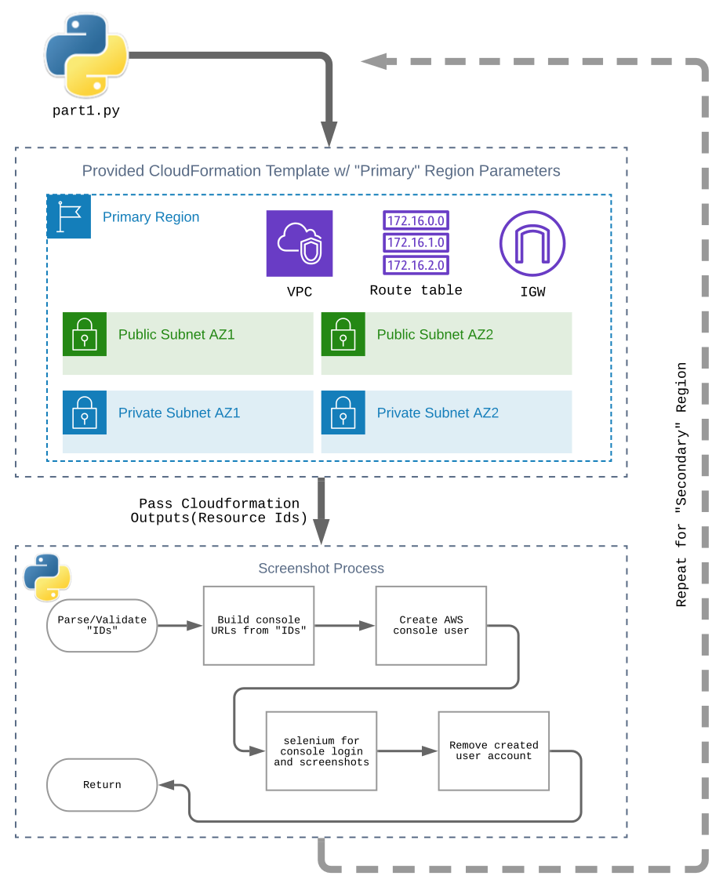

# AWS Cloud Architect Nanodegree: "Project1"
Automated implementation. 

## Goals
 1. To automate the completion of [Udacity Nanodegree nd063 Project1](https://github.com/udacity/nd063-c2-design-for-availability-resilience-reliability-replacement-project-starter-template)
 1. Minimal prerequisites and no manual setup tasks
 1. Use provided CloudFormation templates as-is 
 1. Prefer using AWS services. For example using Code{Build,Deploy,Pipeline} over GitHub Actions 

## Overview
[Udacity Nanodegree nd063 Project1](https://github.com/udacity/nd063-c2-design-for-availability-resilience-reliability-replacement-project-starter-template)

Each part from the above instructions will be broken down into code that will run locally. After each part is created and working sequencally then implement a pipeline to create/reapply when new code is committed(w/hooks)

### Part 1

### Part 2
> WIP
### Part 3
> WIP
 
## Details
- The Project is a collection of resources that are deployed into two Regions
- Resources include 
    - VPC(1 per region)
    - Subnets(4 per VPC, across 2 AZs in each region)
    - Security Groups(1 Database and Application per region)
    - Route Tables(1 for Public/Private per region)
    - Internet Gateway w/attachment (1 per VPC)
    - RDS Subnet group
    - RW MySQL RDS instance(Primary Region)
    - RO MySQL RDS instance(Secondary Region)
    - EC2 instances (Used to test database connectivity)
    - S3 bucket to host a static website
- My Custom resource Additions
    - Selenium Lambda function
        - Takes input of VPC id, Subnet id, etc.
        - Constructs the console url for the id received as input
        - Creates an IAM account and directly attaches a Policy for view only.
        - Runs Selenium to login to the AWS console then screenshots the input item
        - Removes Created IAM account
    - Database Test Lambda Function
        > WIP: This item might be better satisfied with EC2 instance launched with UserData to execute required steps

